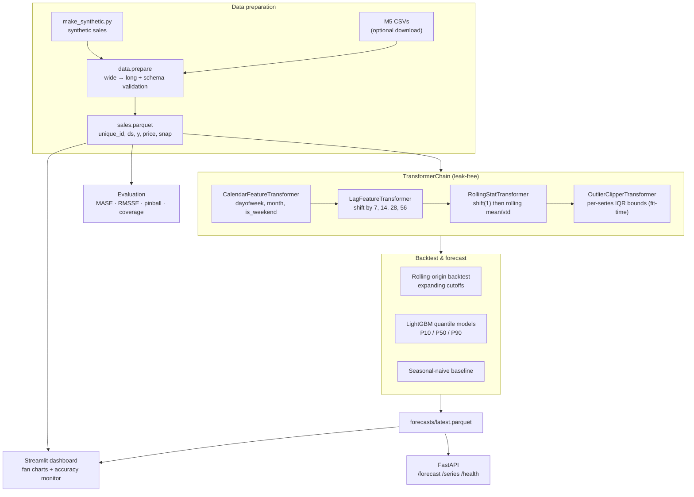

<div align="center">


</div>

# DemandCast — Multi-Horizon Retail Demand Forecasting

**Probabilistic demand forecasts you can plan against — with a feature pipeline that can't peek at the future.** DemandCast forecasts daily unit sales per item-store up to 28 days out, returns P10/P50/P90 fan charts instead of a single fragile point estimate, and builds every lag and rolling feature through a strict `fit`/`transform` chain so the model is never accidentally trained on information it wouldn't have at prediction time.

<div align="center">

[](https://www.python.org/)
[](https://fastapi.tiangolo.com/)
[](https://pytest.org/)
[](https://opensource.org/licenses/MIT)

</div>

---

## The problem

Retail planning teams don't really want "how many units will we sell on the 12th." They want to know how much to hold so they neither stock out nor drown in inventory — which is a question about the *range* of plausible demand, not a single number. A point forecast that says "sell 40" hides whether the honest answer is "35–45" or "10–120."

Two things quietly wreck demand models in practice:

1. **Data leakage.** Rolling means and lag features are easy to compute over the whole series by accident, so the model trains on statistics that include the very days it's meant to predict. It looks brilliant in a notebook and collapses in production.
2. **Overconfidence.** A single point estimate gives planners nothing to size safety buffers against.

DemandCast addresses both: features flow through a composable transformer chain where every step is explicitly shifted to use only past data, and the forecaster emits quantiles so downstream planning sees the uncertainty.

## What it does

- Turns raw item-store sales into a clean canonical long frame (`unique_id`, `ds`, `y`, plus price / SNAP / event signals), validated against a schema.
- Builds leak-free calendar, lag, and rolling-window features through a scikit-learn-style transformer chain.
- Produces **probabilistic 28-day forecasts** (P10 / P50 / P90) per series and stores them for fast serving.
- Serves those forecasts over a small FastAPI service and visualises them as fan charts in a Streamlit dashboard.
- Monitors accuracy: as new actuals arrive, it recomputes rolling MASE and flags degradation past a configurable threshold.

## How it works

Data is prepared and forecasts are computed **offline** as a batch job; the API and UI only ever read precomputed results, so serving is fast and reproducible and training never happens on the request path.



## Architecture: the transformer chain

The core pattern is a **transformer chain** — an ordered list of steps, each implementing the scikit-learn `fit(X, y)` / `transform(X)` / `fit_transform` contract (`pipeline/base.py` defines the `TransformerStep` protocol). The chain guarantees the same transformations run identically across backtesting and serving, and that anything learned from data (clipping bounds) is learned only at `fit` time.

The leak-free discipline lives in the individual steps:

- **`LagFeatureTransformer`** sorts by series and time, then `shift(k)` within each `unique_id` — lag *t−k* can only ever contain values strictly before *t*.
- **`RollingStatTransformer`** applies `shift(1)` *before* the rolling window, so a rolling mean at time *t* never includes *t* itself.
- **`OutlierClipperTransformer`** learns per-series quantile bounds during `fit` and applies them at `transform`, so inference-time spikes are clipped against training-derived limits rather than the test window.

```python
chain = (
    TransformerChain()
    .add_step("calendar", CalendarFeatureTransformer())
    .add_step("lags", LagFeatureTransformer(lags=[7, 14, 28, 56]))
    .add_step("rolling", RollingStatTransformer(windows=[7, 28]))
)
features = chain.fit_transform(sales)
```

## Methodology

### Rolling-origin backtesting

Instead of a single train/test split, evaluation walks an expanding origin forward through time (configured by `backtest.n_windows` and `step_size`), refitting at each cutoff and forecasting the next horizon. This mimics how a model would actually be retrained in production and keeps every evaluation strictly out-of-sample. A seasonal-naive forecaster ("repeat last week") serves as the baseline every model must beat.

### Probabilistic forecasts

The forecaster emits quantiles `[0.1, 0.5, 0.9]` per series and horizon step, trained with LightGBM's quantile objective. The API and dashboard surface these directly as P10–P90 bands.

### Scale-free accuracy metrics

Forecast quality is scored with metrics that are comparable across fast- and slow-moving items (`evaluation/metrics.py`):

- **MASE** — mean absolute error scaled by the training set's seasonal-naive error (season = 7). Below 1.0 means "better than repeating last week."
- **RMSSE** — the squared-error counterpart used by the M5 competition.
- **Pinball loss** — the quantile loss that measures calibration of the P10/P50/P90 fan:

$$L_q(y, \hat{y}) = \max\big(q\,(y - \hat{y}),\ (q - 1)(y - \hat{y})\big)$$

- **Interval coverage** — the empirical fraction of actuals falling inside the P10–P90 band (well-calibrated ≈ 0.8).

## From a forecast to an order quantity

A daily quantile fan is not a replenishment decision. Turning one into the other
is where forecasting systems lose money, because the arithmetic that looks
obvious is wrong in a specific and expensive way.

`/replenish` runs the pipeline that does it: `leadtime` aggregates the daily fan
over the lead time, `calibrate` conformalises the band, `position` converts it to
an order-up-to level, `policy` emits the order, and `audit` decides whether the
series is fit to be ordered against at all.

### Summing daily P90s is not a P90

Ask a planner to cover a 7-day lead time at 90% and the natural move is to add
up seven daily P90s. That quantity is only correct if the seven days are
*perfectly correlated* — one bad day implying all seven are bad. Real demand is
nothing like that, so the sum lands far above the quantile it claims to be.

Replaying the same base-stock simulator over 80 series at a 7-day lead time and
a 90% fill target:

```
       policy     fill  mean on-hand  stockout d  below target
 quantile_sum   0.9969         37.27          21             0
 variance_sum   0.9595         19.51         176            11
      floored   0.9676         21.57         142             8

quantile_sum holds +91.0% inventory vs variance_sum, +72.8% vs floored
```

`quantile_sum` does hit the best fill — it is not *broken*, it is
over-conservative — but it buys roughly four points of fill with **91% more
stock on hand**. `variance_sum` adds the daily sigmas in quadrature instead,
which is the independent-demand assumption and undershoots on the spikier
series. `floored` is what `/replenish` actually uses: quadrature, with each
day's sigma floored at that series' own seasonal-naive residual volatility, so a
series the model happens to fit tightly in-sample cannot talk itself into a
thin band.

### The band is not as good as it claims

Reported rather than buried: the P10–P90 interval covers **70.7%** of held-out
actuals against a nominal 80%, and 2 of 2,240 forecast rows come back with
crossed quantiles. That is why `calibrate` exists, and why `audit` gates the
series — it flagged 2 of the 80 live series as unfit to order against without
review.

Reproduce with:

```bash
uv run python scripts/leadtime_study.py
```

## Getting started

```bash
make install                 # uv sync --group dev
make data                    # generate synthetic sales + build sales.parquet
make refresh                 # compute forecasts -> data/forecasts/latest.parquet

make api                     # FastAPI on http://localhost:8020
make ui                      # Streamlit dashboard on http://localhost:8501
```

Other targets:

```bash
make backtest                # rolling-origin backtest report
make mlflow                  # MLflow UI on http://localhost:5002
make test                    # pytest --cov
make lint                    # ruff check + format --check
```

By default the pipeline runs on synthetic data, so it works with no Kaggle credentials. To use the real M5 Walmart dataset instead, place the M5 CSVs under `data/raw/` (or `make data-m5`) and re-run `make data`.

Or with Docker:

```bash
make docker-up               # API on :8020, dashboard on :8521
```

## API

The service reads precomputed forecasts from `data/forecasts/latest.parquet`; run `make refresh` first or endpoints return `503`.

| Method | Route | Purpose |
|---|---|---|
| `GET` | `/health` | Liveness check |
| `GET` | `/series` | List all available series ids (`ITEM_xxx/ST_x`) |
| `GET` | `/forecast?unique_id=<id>&h=28` | Forecast points for one series: `yhat` plus `q10` / `q50` / `q90`, up to 28 steps |
| `GET` | `/replenish?unique_id=<id>&lead_time=7` | Order-up-to level and order quantity for one series, with the audit verdict that gates it |

## Evaluation

Evaluation runs against a known series (synthetic by default, or the M5 subset if provided), so there is a ground truth to score against. The backtest reports MASE, RMSSE, pinball loss, and interval coverage across the rolling windows, and compares the LightGBM quantile model to the seasonal-naive baseline. To reproduce:

```bash
make backtest
```

Numbers are intentionally not quoted here — they depend on the generated dataset, seed, and configuration. Run the backtest to produce them for your setup.

## Testing

```bash
make test        # pytest --cov
```

- `test_transformer_chain.py` — chain composition and per-step transforms
- `test_features.py` — leak-free lag / rolling / calendar features
- `test_backtest.py` — rolling cutoffs and baseline forecaster shape
- `test_metrics.py` — MASE / RMSSE / pinball / coverage
- `test_prepare.py` — data preparation and schema validation
- `test_replenishment.py` — the aggregation rules (that summing daily P90s exceeds the quadrature level, and that the volatility floor only ever widens a band), base-stock fill monotone in the order-up-to level, service non-increasing in lead time, and the audit gate refusing a series rather than ordering against it
- `test_api.py` — HTTP contract tests

## Limitations

- The quadrature aggregation assumes daily forecast errors are independent. They are not - promotions and weather correlate them - so the true lead-time quantile sits somewhere between `variance_sum` and `quantile_sum`, and the volatility floor is a blunt way of buying back that gap rather than a model of it.
- The base-stock replay is a simulation on held-out history with a fixed lead time and no supplier variability, minimum order quantity, or shelf life. It ranks the aggregation rules against each other; it does not predict a real fill rate.
- Measured band coverage is 70.7% against a nominal 80%. Conformal calibration narrows that gap on the series it has residuals for, but a new series starts uncalibrated.

- **Forecasts are precomputed, not live.** The API serves a stored parquet; a new series or a data change requires re-running `make refresh`.
- **CPU-sized by design.** The default config keeps only a couple of stores and the top items (`data.stores`, `top_items`) so it runs on a laptop; real deployments would need to scale the training step.
- **Synthetic data by default.** Thresholds (outlier clipping quantiles, the monitoring degradation cutoff) are tuned for the synthetic distribution and would need recalibration on real sales.
- **Global feature config.** Lags and windows are set in `configs/config.yaml`; there is no per-series feature selection or hierarchical reconciliation.

## Project structure

```
src/demandcast/
├── pipeline/      # TransformerStep protocol, leak-free transformers, TransformerChain
├── features/      # thin feature-building layer over the chain
├── data/          # M5 download, prepare (wide→long), pandera schema
├── evaluation/    # MASE, RMSSE, pinball loss, interval coverage
├── monitoring/    # rolling-MASE degradation tracker
├── api/           # FastAPI app (main:app) and forecast routes
└── ui/            # Streamlit fan-chart + accuracy-monitor dashboard
configs/           # pipeline, forecast, backtest, and model config (config.yaml)
scripts/           # make_synthetic.py, refresh_forecasts.py (batch jobs)
```

## License

MIT

---

<div align="center">

**Jackson Marcus** · Senior AI & Machine Learning Engineer

[](https://github.com/jackson-marcus)
[](mailto:wajahatanees41@gmail.com)

</div>
