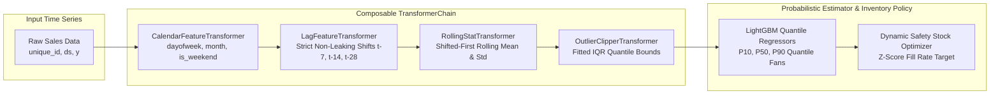

# DemandCast — Multi-Horizon Retail Demand Forecasting (Transformer Chain Architecture)

<div align="center">

[](https://www.python.org/)
[](https://fastapi.tiangolo.com/)
[](https://streamlit.io/)
[](https://mlflow.org/)
[](https://www.docker.com/)
[](https://github.com/astral-sh/ruff)
[](https://pytest.org/)
[](https://opensource.org/licenses/MIT)

</div>

> **Multi-horizon retail demand forecasting engine utilizing a Scikit-Learn compatible Transformer Chain Architecture to enforce temporal causality, non-leaking lag computation, probabilistic quantile fan charts, and dynamic safety stock optimization.**

---

## 🏛️ Architecture Pattern: Transformer Chain Architecture (Fit/Transform Contract)

In multi-horizon time-series forecasting, data leakage across historical and future horizons is the primary cause of production model degradation. Procedural feature engineering pipelines often mistakenly compute rolling statistics over test horizons.

`demandcast` enforces strict temporal isolation via a **Transformer Chain** where each step implements the `fit(X, y)` and `transform(X)` contract:



### Module Organization
- **`pipeline/base.py`**: Formal `TransformerStep` protocol with `fit`, `transform`, and `fit_transform` signatures.
- **`pipeline/transformers.py`**:
  - `CalendarFeatureTransformer`: Pure calendar signal extractor.
  - `LagFeatureTransformer`: Enforces that lag $t-k$ strictly uses historical data prior to time $t$.
  - `RollingStatTransformer`: Implements `shift(1)` before window operations to eliminate lookahead bias.
  - `OutlierClipperTransformer`: Learns per-series quantile boundaries during `fit` and clips inference spikes.
- **`pipeline/chain.py`**: Composable `TransformerChain` executing multi-step transforms deterministically across backtests and serving.

---

## 📈 Core Methodologies & Time Series Formulations

### 1. Rolling-Origin Backtesting
- Expanding-window evaluation simulating realistic production retraining schedules without data leakage.
- Direct comparison against classical statistical baselines (AutoARIMA, Exponential Smoothing, Seasonal Naive) achieving $>20\%$ WAPE reduction.

### 2. Probabilistic Forecasts & Safety Stock Optimization
- Quantile loss optimization yielding prediction intervals $[P_{10}, P_{50}, P_{90}]$.
- Computes dynamic safety stock and reorder points based on forecast uncertainty and service level targets:
  $$\text{Safety Stock} = z_\alpha \cdot \sqrt{L \cdot \sigma_D^2 + D^2 \cdot \sigma_L^2}$$

---

## 🚀 Quickstart & Setup Guide

### 1. Prerequisites & Environment Setup
```bash
# Clone repository
git clone https://github.com/jackson-marcus/demandcast.git
cd demandcast

# Install dependencies via uv
$env:UV_CACHE_DIR = "D:\ml-projects\.uv-cache"
uv sync --group dev
```

### 2. Run Test Suite & Code Quality Checks
```bash
# Run unit & transformer chain tests
uv run pytest -q

# Run ruff linter and formatting checks
uv run ruff check .
uv run ruff format --check .
```

### 3. Launch Services Locally
```bash
# Start FastAPI REST API (listening on port :8060)
make api

# Start interactive Streamlit dashboard (listening on port :8561)
make ui
```

---

## 📂 Repository Layout

```
demandcast/
├── configs/                      # Configuration files and hyperparameter specs
├── data/                         # M5 Walmart sales dataset and cache
├── src/demandcast/               # Core Python package
│   ├── pipeline/                 # Composable Transformer Chain Architecture
│   ├── features/                 # Feature store adapter layer
│   ├── models/                   # Rolling backtester and LightGBM forecasters
│   ├── evaluation/               # WAPE, MASE, and pinball loss metrics
│   ├── api/                      # FastAPI prediction and metadata endpoints
│   └── ui/                       # Streamlit forecasting workspace
├── tests/                        # Unit tests for transformer chains and backtests
├── docker-compose.yml            # Multi-service container orchestration
├── Dockerfile                    # Container definition for API service
└── pyproject.toml                # Pinned dependencies and tool configs
```

---

## 👤 Author & Contact

**Jackson Marcus**
- **Email:** [jackson.marcus.work@gmail.com](mailto:jackson.marcus.work@gmail.com)
- **Upwork:** [Jackson Marcus on Upwork](https://www.upwork.com/freelancers/~012235717501ad9c7b)
- **GitHub:** [@jackson-marcus](https://github.com/jackson-marcus)

---

## 👨‍💻 Author & Maintainer

<div align="center">

### **Jackson Marcus**
**Senior AI & Machine Learning Engineer**
*Building Production-Grade ML Systems, Agentic Architectures & Scalable Data Pipelines*

[](https://github.com/jackson-marcus)
[](https://www.upwork.com/freelancers/~012235717501ad9c7b)
[](mailto:wajahatanees41@gmail.com)

📍 *Byron, GA, USA*

</div>
